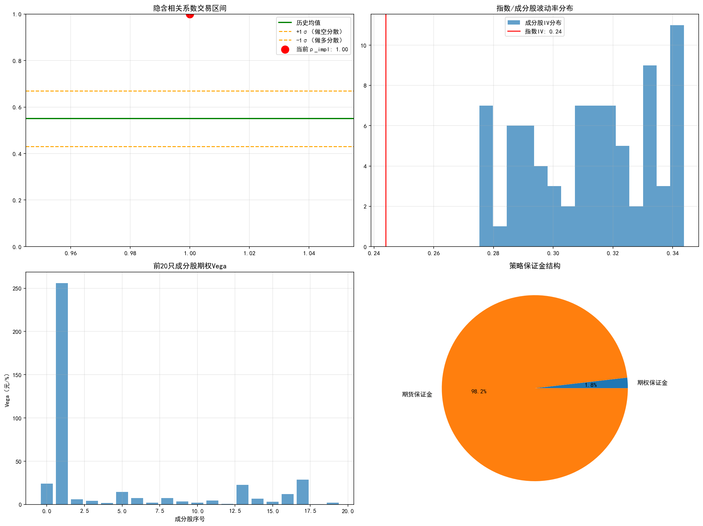

#### run 

```
python  dispersion.py
```


 


```
正在获取沪深300成分股及权重...
获取到80只沪深300成分股
正在获取指数/成分股价格数据...
login success!
logout success!
价格数据时间范围：2023-01-03 00:00:00 ~ 2023-12-29 00:00:00
正在配置IO期权参数...
login success!
logout success!
隐含相关系数计算完成：1.0000

============================================================
【沪深300股指分散交易策略报告】（无Tushare版）
============================================================
1. 核心信号
   隐含相关系数：1.0000
   策略方向：short_dispersion
   历史均值±1σ：[0.4300, 0.6700]

2. 头寸配置
   沪深300 IO期权：sell 1手（行权价：3500）
   成分股期权：buy 合计24887.0手
   IF期货对冲：3860.0手（乘数：300）

3. 资金占用
   期权保证金：5967317.45 元
   期货保证金：322654123.63 元
   总保证金：328621441.08 元

4. 收益模拟
   30天模拟收益：8037.19 元
   保证金收益率：0.00%
   年化收益率：0.03%
============================================================


 

```
